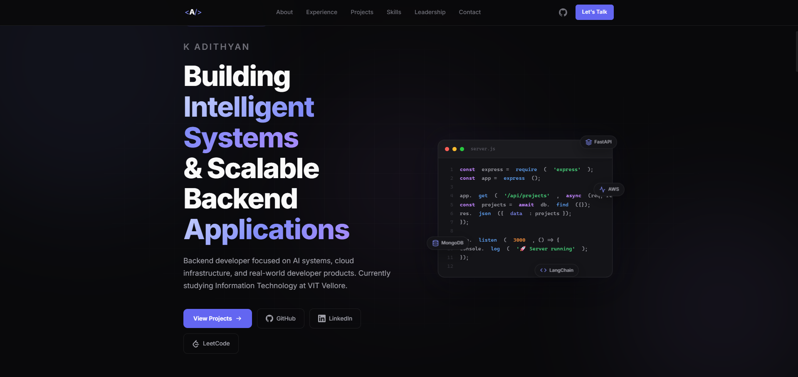

# K Adithyan - Developer Portfolio

A modern, high-performance developer portfolio built with HTML, CSS, and Vanilla JavaScript. The design emphasizes a premium dark theme, glassmorphism, smooth scroll animations, and responsive layouts to showcase software engineering skills, projects, and professional experience.

 *(Note: Add a screenshot of your portfolio to the `assets` folder and name it `portfolio-preview.png`)*

## 🚀 Live Demo

[Insert Link to Live Portfolio Here]

## ✨ Features

*   **Modern Design:** Premium dark theme (`#09090b` base) inspired by top-tier engineering blogs (Vercel, Stripe).
*   **Glassmorphism UI:** Subtle translucent backgrounds and borders for a depth-oriented aesthetic.
*   **Smooth Animations:** Custom scroll-reveals (via Intersection Observer), parallax background orbs, typing effects, and a floating code terminal animation in the hero section.
*   **Project Filtering:** Dynamic category filtering for the 'Featured Projects' section without page reloads.
*   **Fully Responsive:** Seamless layout adjustments from large desktop monitors down to mobile devices.
*   **Optimized Performance:** Built with vanilla web technologies, ensuring fast load times and minimal rendering overhead.
*   **Interactive Code Window:** A realistic, animated code terminal mockup on the hero section simulating backend development.

## 🛠️ Tech Stack

*   **HTML5:** Semantic structure and accessibility.
*   **CSS3:** Custom properties (variables), Flexbox, CSS Grid, animations, and media queries. No external CSS frameworks used.
*   **JavaScript (ES6+):** DOM manipulation, Intersection Observer API for scroll animations, and event handling.
*   **Typography:** [Inter](https://fonts.google.com/specimen/Inter) font from Google Fonts.

## 📂 Project Structure

```
portfolio/
├── index.html        # Main HTML document containing the structure and content
├── style.css         # All styling, including animations, responsive design, and variables
├── script.js         # Interactive logic: scrolling, project filtering, active nav states
├── README.md         # Project documentation (this file)
└── assets/           # Directory for project screenshots, logos, and icons
    ├── admark-logo.png
    ├── Ai-Study-Buddy.png
    ├── AWS-Notes-App.png
    ├── CampFire.png
    ├── CreditCardPredictor.png
    ├── Movie-Search-App.png
    ├── Network-IDS-IPS.png
    └── TypeMeter.png
```

## 🏗️ Getting Started (Local Development)

To run this portfolio locally on your machine, no build tools or package managers are required.

To view the project, simply clone the repository and use a local development server to serve the files. Using a local server is recommended over opening `index.html` directly to ensure all paths and assets resolve correctly.

1.  **Clone the repository:**
    ```bash
    git clone https://github.com/AdithyanKollon/portfolio.git
    cd portfolio
    ```

2.  **Start a local server:**
    You can use any local HTTP server. For example, using Node.js (`http-server`) or Python:

    *Using Node.js:*
    ```bash
    npx http-server . -p 8888
    ```
    *Using Python 3:*
    ```bash
    python -m http.server 8888
    ```

3.  **View in browser:**
    Open your browser and navigate to `http://localhost:8888`.

## 👨‍💻 About Me

Hi, I'm **K Adithyan**, a Backend Developer and AI Systems Builder based in India. Currently pursuing my IT degree at VIT Vellore, I focus on building real-world developer products, scalable cloud infrastructure, and intelligent RAG systems.

*   [GitHub Profile](https://github.com/AdithyanKollon)
*   [LinkedIn Profile](https://linkedin.com/in/YOUR_LINKEDIN_URL) *(Remember to update this in the HTML)*
*   [LeetCode Profile](https://leetcode.com/u/YOUR_LEETCODE_USERNAME) *(Remember to update this in the HTML)*

## 📄 License

This project is licensed under the MIT License - see the [LICENSE](LICENSE) file for details.
